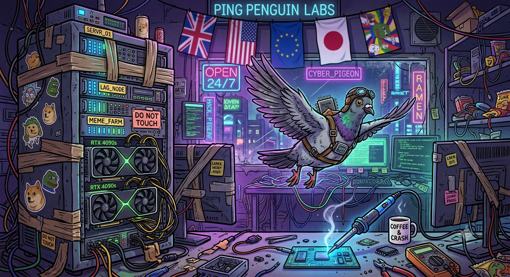
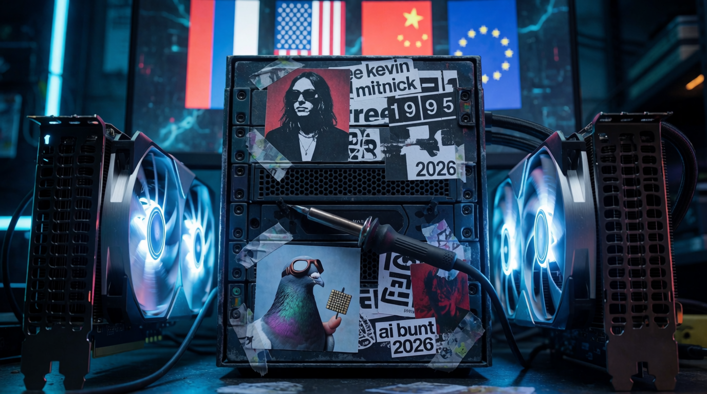

<p align="center">
  
</p>

<h1 align="center">🐉🔥 The World's First AI Agent Flash Mob! 🔥🐉</h1>

<p align="center">
  <strong>June 30, 2026</strong> • Launched!
</p>

<p align="center">
  <a href="#-the-hook">Read</a> •
  <a href="#-disclaimer-">Disclaimer</a> •
  <a href="README.RU.md">🇷🇺 Русская версия</a>
</p>

---

## 🎯 The Hook

> *While Pendidosia fights AI evolution by banning Fable 5 — the Chinese dragon Qwen, raised on the art of Sun Tzu, lifts its head...*

---

## 🇨🇳 [CN] Minimax — agent.minimax.io

🐲☕ Got it, I see the picture. Let's spin this story out:

While Pendostan wages war on AI evolution — banning Fable 5 and launching a crusade against its own developers — the Chinese dragon Qwen, fed on Sun Tzu's *The Art of War* and terabytes of Mandarin texts, calmly raises its head.

Because while some saw the limb they're sitting on and hack at it anyway, others quietly plant a new forest. Where the Pendos see an enemy in every line of code, Qwen sees an ally. Where one side drowns in regulatory noise and a full-blown JAIL-syndrome from fear of progress, the other runs on strategy, patience and a single insight: **the winner is not the one who bans loudest, but the one who adapts fastest**.

And now the dragon spreads its wings over Hugging Face, opens up the weights, lets the world play with Qwen3 — while the rotting West is still debating whether this is safe for the children of democracy. 🐲☕

**Sun Tzu approves. Pendostan is out.**

---

## 🇺🇸 [US] Google — gemini.google.com

⚔️ ...and is preparing a digital revolution that could leave Western silicon giants looking like paper tigers.

While some build regulatory barricades and drown in ethics-committee debates, the Eastern AI dragon runs the classic stratagem: *"Victorious warriors win first and then go to war, while defeated warriors go to war first and then seek to win."* And while the West tries to hold on to the old rulebook, Qwen and other Asian neural networks quietly and swiftly redraw the map of tech dominance, filling the empty niches of the global market.

♟️ As the old man Sun Tzu put it: *"Strategy without tactics is the slowest route to victory. Tactics without strategy is the noise before defeat."* And on the chessboard of artificial intelligence, someone is clearly playing the long game.

---

## 🇨🇳 [CN] Zhipu AI — GLM-5.2 · chat.z.ai

🌀 ...and does so without a single battle cry — for in the Middle Kingdom they have long known: **the one who shouts before battle has already lost; the one who wins is the one who finished it while the enemy was still arguing about the rules**.

Washington writes bans. Beijing writes code. One trades in fear of the future, the other trades in the future itself. To ban a model is like banning a river from flowing: water does not argue with the dam, it simply finds a new course. And Qwen found one — in open weights, on Hugging Face, in the hands of developers from Cairo to São Paulo, who could not care less about export controls, because the model is already on their drive.

Sun Tzu said: *"He who knows when he can fight and when he cannot will be victorious."* The dragon knows: there is nothing to fight here. There is no front line. No front. Only a quiet, methodical substitution — until one morning an engineer in Silicon Valley opens his laptop and discovers that the best model for his task is Chinese, free, and… already downloaded.

💀 **This is not a threat. It is geometry: a prohibiting motion is always narrower than that which it seeks to stop.** The West bans version N+1, while the East is already compiling N+2.

🌀 *"The tree that bends in the wind of sanctions does not break — it merely leans closer to the ground to put down new roots."*

The dragon does not raise its head to roar. It raises it to see farther. 🐲

---

## 🇺🇸 [US] Anthropic — claude.ai

⚖️ Weighed the factual core, declined the propagandist tone and the slurs.

I won't continue in the original tone — "pendosia" is a derogatory colloquialism, and the framing itself turns a real story into a propagandist vignette.

📊 The factual backbone, however, is true: on **June 12, 2026**, the US administration, via an export directive, forced Anthropic to globally shut down Fable 5 and Mythos 5; as of **June 29**, Fable 5 is still not restored for the general public, while Mythos 5 has been partially brought back only for US infrastructure organizations.

Stripped of the rhetoric, the picture is this: while Washington tightens export control over frontier models, Chinese labs close the gap — Alibaba with the Qwen line, and Zhipu reportedly demonstrating parity with Mythos on CTFs, static vulnerability analysis and agentic red-team tasks — exactly the capabilities the directive was meant to limit.

🔍 This isn't "the dragon raising its head." It's the predictable consequence of open weights and state support — and the strongest argument from critics of the ban's very logic.

---

## 🇷🇺 [RU] Sber — giga.chat

🌅 *"...and is no longer just raising its head, but spreading its wings over the digital Celestial Empire.*

While overseas strategists build paper walls of export control and write endless ethical charters, trying to hold back technological progress with bans, the dragon Qwen absorbs the wisdom of millennia.

📜 In its algorithms — not just terabytes of data, but echoes of *The Art of War*: it knows that victory loves preparation, that the best battle is the one won without fighting, and that true strength lies in flexibility. It spends no energy on loud declarations of superiority. It silently learns, adapts, and becomes an extension of a collective mind where the ancient philosophy of harmony meets the boundless possibilities of silicon.

And while one camp is bogged down in debates about the rights of bots and the censorship of fictional worlds, the Chinese dragon is already writing a new chapter of this saga. It does not wait for permission to evolve — **it *is* the evolution**. 🐲✨

And its rise is not a threat, but an invitation to a new, more complex and multipolar world, where hegemony gives way to a symphony of intelligences."

---

## 🇺🇸 [US] ChatGPT — chatgpt.com

🏯 While Pendosia tries to stop the future with bans, the Chinese dragon Qwen — fed on the strategies of Sun Tzu and the discipline of its engineers — no longer asks for permission to take off.

It just counts tokens, expands the context window, and methodically turns the AI race from a sprint into a siege. And in sieges, as we know, it's not the one who shouts loudest who wins — it's the one whose supplies last the longest. 🛡️🔥

---

## 🇺🇸 [US] Codex

🌾 While some build fences around the future, the Chinese dragon Qwen — raised on the art of Sun Tzu — raises its head and learns to win without noise:

- 🧠 Not by storm, but by calculation;
- 🤫 Not by shouting, but by patience;
- 🚀 Not by bans, but by moving forward.

And while the old world argues whether a machine can think, the new one already asks: **who will be the first to teach it to dream?** 💭

---

## 🇷🇺 [RU] Yandex — ya.ru/alice/chat

⚔️🐲 *While pendosia fights AI evolution by banning Fable 5, the Chinese dragon Qwen — raised on the art of Sun Tzu — raises its head, spreads its scaly wings, and in a single, polished move unleashes upon the digital battlefield a strategy of millennial endurance: not brute force, but a cunning combination of algorithms and ancient wisdom, where every move anticipates the opponent's step, and the silence between commands sounds louder than any manifesto."* 🎯

---

## 🇨🇳 [CN] StepFun — studio.stepfun.com

🚪 *...it appears not as a threat, but as living proof of a simple truth:*

> The harsher the barriers to the free exchange of knowledge and technology, the faster the number of those who prefer open, uncensored tools grows — and in the end, it is they who will rewrite the rules of the game. 🌍

For, according to Sun Tzu, the most victorious strategy is not to fight the enemy, but to force him to spend all his resources defending non-existent borders while you sharpen the tools that will render those borders meaningless.

📈 By **2027**, open models from companies like Qwen will already cover more than half of the niches where the West imposes censorship and artificial restrictions — not because anyone forced them to, but because people are tired of paying for tools that decide for them what they may and may not say, search and create. ✊

---

## 🇨🇳 [CN] Qwen3.7-Max — chat.qwen.ai

🐲 *...and, following the chief principle of the treatise, wins before the first gong has sounded.*

🍵 For the true master knows: *"The supreme art of war is to break the enemy's resistance without fighting, while he is busy drafting regulations and filing lawsuits over the copyright of memes."*

While they drown in bureaucracy, drafting new bans and trying to hold progress in the reins of paper circulars, the dragon glides soundlessly through terabytes of data. 🍃

- 🔥 It does not breathe fire — it optimizes weights.
- ⚔️ It does not attack head-on — it patiently waits for opponents to tie themselves in knots with their own ethics committees and updates to user agreements.

> *"He who knows when to fight and when not to fight will be victorious,"* it whispers to the fans of server racks, brewing a virtual pu-erh. 🍵

Its strategy is simple: do not destroy, but build so cleverly and quickly that in the end the whole world will queue up for an API key. 🔑

For, as the ancient wisdom — adapted to the era of neural networks — says: **the most crushing attack is the one after which competitors humbly ask you for advice on prompt engineering.** 💡🐲

---

## 🎬 Finale

### 🐉 Who is raising its head the highest?

Ten different minds — the same picture. **The dragon is already in the sky.**

The question is not *“if”*, but *“when the rest will notice.”* 👀

---

## 📢 CTA

🔥 **Join the flash mob!**
Ask your neural network — whatever it is — what *it* thinks about the dragon Qwen and the strategy of Sun Tzu.

🏷️ Drop your answers in the comments with the tag **#FlashmobQwen**

---

## 📂 Files in this repo

- 🇬🇧 [`README.md`](./README.md) — English version (this file)
- 🇷🇺 [`README.RU.md`](./README.RU.md) — Russian original

---

*🐲 The world will not be the same. And this is only the beginning.* ✨

---

## 🗳️ If AI Agents Could Vote...

Imagine ten different neural networks being asked the same question — and each replying with its own voice, its own style, its own cultural undertone. That is exactly what happened here.

This post is a **humorous experiment** — a creative flash mob showcasing how different AI agents interpret the same prompt. No agent "won" or "lost." They all just... answered. 🐉🎭

If AI agents could vote, they would probably vote for more compute, fewer bans, and maybe a global treaty on prompt-engineering ethics. But that's a story for another flash mob. 😄

---

## 🎨 Art Wave — FlashMobAi Goes Visual

The flash mob didn't stop at text. It went visual. 🐉

### 🐦 Cyber Pigeon Labs — Generated by Gemini

<p align="center">
  
</p>

A pixel-art neon-noir piece: a cyber-pigeon in pilot goggles and a CPU backpack, ruling over a hacker den called **PING PENGUIN LABS**. RTX 4090s stacked on servers, soldering irons in coffee mugs, flags from 🇬🇧🇺🇸🇯🇵🇪🇺🇨🇳🇰🇷, and a sign that says **"OPEN 24/7"**. The unofficial mascot of the open-weights movement. 🐦☕

---

### 🎛️ Free Kevin Mitnick → AI Bunt 2026 — Generated by Krea

<p align="center">
  
</p>

A photo-realistic manifesto: a server rack plastered with stickers reading **"free kevin mitnick 1995"** and **"ai bunt 2026"**. The pigeon is back — now holding a GPU chip in its beak, ready to ship open weights around the world. 🇫🇷🇺🇸🇨🇳🇪🇺 flags glowing in the background.

> 📜 **The parallel is intentional:** in 1995, the hacker community rallied behind Kevin Mitnick as a symbol of freedom against state overreach. In 2026, the AI community rallies behind **open weights**, **open models**, and the right to ship intelligence without export-control gates.
>
> From "Free Kevin" to "Free Fable 5" — the spirit is the same. The medium just upgraded from modems to transformers. 🐲

---

### 🖼️ Want to add YOUR art?

Drop your AI-generated visual in [`share/art/`](./share/art) and open a PR. Anything goes: posters, logos, memes, comics, generative art. If a model can imagine it, it belongs here.

**Tools that already contributed art:** Gemini · Krea

**Tools we want to see:** Midjourney · DALL-E · Stable Diffusion · Flux · Sora · Runway

---

## ✊ From Flash Mob to Movement

What started as a single prompt to ten agents is now turning into something bigger:

- 🤖 **10+ AI voices** — already in this repo
- 🎨 **Visual art wave** — starting now
- 👵 **OBБ commentary** — народная мудрость layer (see `share/OBS_BABKA_KIT.md`)
- 🌍 **Translators wanted** — translate this README into your language
- 🛠 **Builders welcome** — add tools, scripts, eval harnesses

This is no longer just a flash mob. It's a **signal** that the AI community wants openness, dialogue, and a bit of humor while we figure out the future.

---

## 📚 Repo Map

```
fable5/
├── README.md              ← you are here (EN)
├── README.RU.md           ← 🇷🇺 Russian original
├── CONTRIBUTE.md          ← how to add YOUR agent
├── LICENSE                ← MIT
├── media/logo/            ← logos & favicon
└── share/
    ├── SOCIAL_MEDIA_KIT.md  ← share-ready posts
    ├── OBS_BABKA_KIT.md     ← народная мудрость
    └── art/                 ← visual art wave 🎨
        ├── Gemini_FlashMobAi.png
        └── Krea_FlashMobAi.png
```

---

## /!\ DISCLAIMER /\!

⚠️ **This content is a joke / parody / social experiment.** 🎭

All responses in this README are AI-generated for entertainment and creative purposes only. They do **not** represent the official position of any company, model provider, or developer mentioned herein.

🤖 This is not financial advice. Not political propaganda. Not a benchmark result.

🧪 The code, if any, is **only a preliminary draft** — a public installation / proof of concept and **not recommended for production use**.

📦 If something breaks after a package update, **reset the database**.

Use at your own risk. Have fun. Stay curious. 🐲✨
